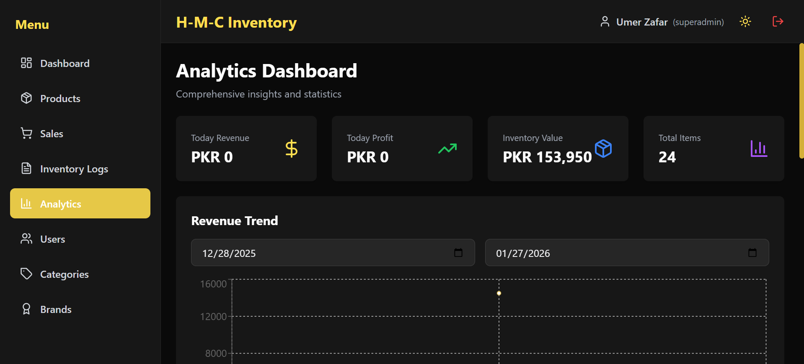

# H-M-C Inventory Management System


A full-stack **Inventory Management & POS System** built using the **PERN Stack (PostgreSQL, Express, React, Node.js)**.  
Designed specifically for a **mobile & accessories shop**, with role-based access, sales tracking, analytics, and stock control.

---
## Features

- ✅ Complete CRUD operations for products and variants
- ✅ Search and filtering by categories and brands
- ✅ Role-based access control (Superadmin, Admin, Staff)
- ✅ Accurate profit calculations and analytics (Superadmin only)
- ✅ Complete inventory tracking and logs
- ✅ Email verification and password reset
- ✅ Session-based authentication with Passport.js
- ✅ Dark/Light theme toggle
- ✅ Responsive design with animations
- ✅ Black and Gold color scheme

## 🖥️ Screenshots

> 📸 **Main Dashboard**


> 📸 **POS Screen**


> 📸 **Inventory Management**


> 📸 **Analytics Page**



---

## Tech Stack

### Backend
- Node.js + Express.js
- PostgreSQL
- Passport.js (Session Authentication)
- ES Modules
- MVC Architecture
- Express Validator
- Nodemailer

### Frontend
- ReactJS
- Vite
- Redux Toolkit
- TanStack Query
- Axios
- React Router DOM
- Tailwind CSS
- Animate.css + AOS
- React Hot Toast
- SweetAlert2
- Lucide React Icons
- Recharts

---


## Setup Instructions

### Prerequisites
- Node.js (v18 or higher)
- PostgreSQL (v12 or higher)
- npm or yarn

### Database Setup

1. Create a PostgreSQL database:
```sql
CREATE DATABASE hmc_inventory;
```

2. Run the schema:
```bash
psql -U postgres -d hmc_inventory -f database/schema.sql
```

### Backend Setup

1. Navigate to backend directory:
```bash
cd backend
```

2. Install dependencies:
```bash
npm install
```

3. Create `.env` file :
```env
PORT=5000
NODE_ENV=development
DB_HOST=localhost
DB_PORT=5432
DB_NAME=hmc_inventory
DB_USER=postgres
DB_PASSWORD=your_password
SESSION_SECRET=your_secret_session_key
EMAIL_HOST=smtp.gmail.com
EMAIL_PORT=587
EMAIL_USER=your_email@gmail.com
EMAIL_PASS=your_app_password
EMAIL_FROM=noreply@hmcinventory.com
FRONTEND_URL=http://localhost:5173
```

4. Start the server:
```bash
npm run dev
```

### Frontend Setup

1. Navigate to frontend directory:
```bash
cd frontend
```

2. Install dependencies:
```bash
npm install
```

3. Start the development server:
```bash
npm run dev
```

## User Roles

- **Superadmin**: Full access including analytics, user management, and all features
- **Admin**: Can manage products, sales, categories, brands, and view basic reports
- **Staff**: Can view products and create sales

## API Endpoints

### Authentication
- `POST /api/auth/register` - Register new user
- `POST /api/auth/login` - Login
- `POST /api/auth/logout` - Logout
- `GET /api/auth/me` - Get current user
- `GET /api/auth/verify-email` - Verify email
- `POST /api/auth/forgot-password` - Request password reset
- `POST /api/auth/reset-password` - Reset password

### Products
- `GET /api/products` - Get all products (with filters)
- `GET /api/products/:id` - Get product by ID
- `POST /api/products` - Create product (Admin only)
- `PUT /api/products/:id` - Update product (Admin only)
- `DELETE /api/products/:id` - Delete product (Admin only)
- `POST /api/products/:id/variants` - Create variant (Admin only)
- `PUT /api/products/variants/:id` - Update variant (Admin only)
- `DELETE /api/products/variants/:id` - Delete variant (Admin only)
- `POST /api/products/variants/:id/adjust-stock` - Adjust stock (Admin only)

### Sales
- `GET /api/sales` - Get all sales
- `GET /api/sales/:id` - Get sale by ID
- `POST /api/sales` - Create sale

### Analytics (Superadmin only)
- `GET /api/analytics/daily` - Daily statistics
- `GET /api/analytics/monthly` - Monthly statistics
- `GET /api/analytics/inventory-value` - Total inventory value
- `GET /api/analytics/revenue` - Revenue by date range
- `GET /api/analytics/top-selling` - Top selling products
- `GET /api/analytics/low-stock` - Low stock items
- `GET /api/analytics/profit-by-month` - Profit by month

## License

ISC

## Author

Umer Zafar


 